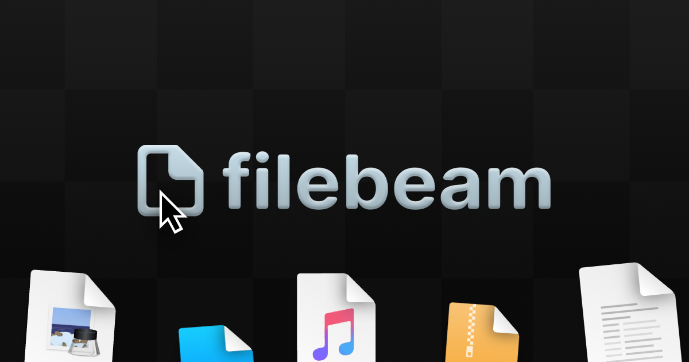

    
    <h3 align="center">
        Comparte archivos, en cualquier lugar.
    </h3>
    

        Filebeam es un servicio el cual te permite compartir archivos
        rápidamente a traves de enlaces directos
    

    

